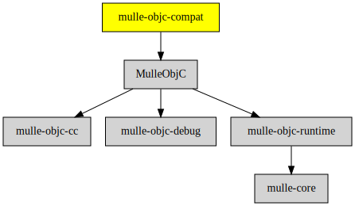

# mulle-objc-compat

#### 🍏 Compatibility layer with Apple Objective-C runtime functions

This library maps
[Apple runtime](//developer.apple.com/documentation/objectivec/objective_c_runtime?language=objc)
functions to their [mulle-objc](//mulle-objc.github.io) counterparts.
This makes porting of existing programs that use Apple runtime functions easier.
If you can get by with the limited set of functions, these functions are
preferable to use over their mulle-objc counterparts for the sake of portability
and familiarity.


| Release Version                                       | Release Notes
|-------------------------------------------------------|--------------
|  [](//github.com/mulle-objc/mulle-objc-compat/actions) | [RELEASENOTES](RELEASENOTES.md) |


## Mental model

This library

* does not include any other runtime than mulle-objc-runtime.
* does not define any functionality that is not part of the Apple runtime
* does not implement everything that's in the Apple runtime


## Limitations

* This library hasn't been scrutinized for thread-safety.
* Some functionality is missing that mulle-objc does not support. E.g. "weak variables".
* Message sending via `objc_msgSend` uses the [mulle-objc MetaABI](//www.mulle-kybernetik.com/weblog/2015/mulle_objc_meta_call_convention.html) and therefore is only compatible in the case, where there is only one pointer sized parameter and a pointer sized return value.
* The library must be compiled with mulle-clang (since the multiverse changes)


### You are here




## Requirements

|   Requirement         | Release Version  | Description
|-----------------------|------------------|---------------
| [MulleObjC](https://github.com/mulle-objc/MulleObjC) |  [](https://github.com/mulle-objc/MulleObjC/actions/workflows/mulle-sde-ci.yml) | 💎 A collection of Objective-C root classes for mulle-objc


## Add

Use [mulle-sde](//github.com/mulle-sde) to add mulle-objc-compat to your project.
As long as your sources are using `#include "include-private.h"` and your headers use `#include "include.h"`, there will nothing more to do:

``` sh
mulle-sde add github:mulle-objc/mulle-objc-compat
```

To only add the sources of mulle-objc-compat with dependency
sources use [clib](https://github.com/clibs/clib):

## Legacy adds

One common denominator is that you will likely have to add
`#include <mulle-objc-compat/mulle-objc-compat.h>` to your source files.


### Add sources to your project with clib

``` sh
clib install --out src/mulle-objc mulle-objc/mulle-objc-compat
```

Add `-isystem src/mulle-objc` to your `CFLAGS` and compile all the
sources that were downloaded with your project. (In **cmake** add
`include_directories( BEFORE SYSTEM src/mulle-objc)` to your `CMakeLists.txt`
file).


### Add as subproject with cmake and git

``` bash
git submodule add -f --name "mulle-core" \
                            "https://github.com/mulle-core/mulle-core.git" \
                            "stash/mulle-core"
git submodule add -f --name "mulle-objc-runtime" \
                            "https://github.com/mulle-objc/mulle-objc-runtime.git" \
                            "stash/mulle-objc-runtime"
git submodule add -f --name "mulle-objc-debug" \
                            "https://github.com/mulle-objc/mulle-objc-debug.git" \
                            "stash/mulle-objc-debug"
git submodule add -f --name "mulle-objc-compat" \
                            "https://github.com/mulle-objc/mulle-objc-compat" \
                            "stash/mulle-objc-compat"
git submodule update --init --recursive
```

``` cmake
add_subdirectory( stash/mulle-objc-compat)
add_subdirectory( stash/mulle-objc-debug)
add_subdirectory( stash/mulle-objc-runtime)
add_subdirectory( stash/mulle-core)

target_link_libraries( ${PROJECT_NAME} PUBLIC mulle-objc-compat)
target_link_libraries( ${PROJECT_NAME} PUBLIC mulle-objc-debug)
target_link_libraries( ${PROJECT_NAME} PUBLIC mulle-objc-runtime)
target_link_libraries( ${PROJECT_NAME} PUBLIC mulle-core)
```


## Install

### Install with mulle-sde

Use [mulle-sde](//github.com/mulle-sde) to build and install mulle-objc-compat and all dependencies:

``` sh
mulle-sde install --prefix /usr/local \
   https://github.com/mulle-objc/mulle-objc-compat/archive/latest.tar.gz
```

### Manual Installation

Install the [Requirements](#Requirements) and then
install **mulle-objc-compat** with [cmake](https://cmake.org):

``` sh
cmake -B build \
      -DCMAKE_INSTALL_PREFIX=/usr/local \
      -DCMAKE_PREFIX_PATH=/usr/local \
      -DCMAKE_BUILD_TYPE=Release &&
cmake --build build --config Release &&
cmake --install build --config Release
```


## Author

[Nat!](https://mulle-kybernetik.com/weblog) for Mulle kybernetiK  


